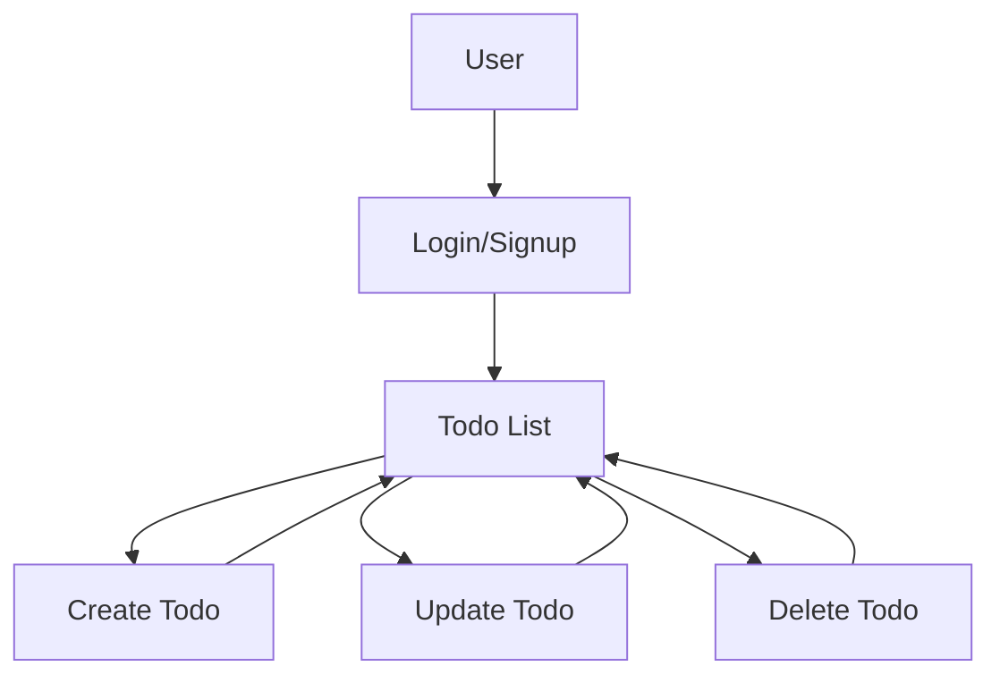

# Django Todo App


This is a simple Django-based Todo application that allows users to create, update, and delete tasks. The application also includes user authentication, password reset functionality, pagination, and search functionality.

## Features

- User authentication (login, logout, signup)
- Password reset functionality
- Create, update, and delete tasks
- Pagination for the todo list
- Search functionality for todos
- Improved UI/UX design

## Setup Instructions

1. Clone the repository:

```bash
git clone https://github.com/MahdiSiamaki/Django-TodoApp.git
cd Django-TodoApp
```

2. Create and activate a virtual environment:

```bash
python -m venv venv
source venv/bin/activate  # On Windows, use `venv\Scripts\activate`
```

3. Install the required dependencies:

```bash
pip install -r requirements.txt
```

4. Apply the database migrations:

```bash
python manage.py migrate
```

5. Create a superuser (admin) account:

```bash
python manage.py createsuperuser
```

6. Populate the database with demo data:

```bash
python manage.py insert_data
```

This will create a demo user with the username 'demo_user' and password 'demo1234', along with five random tasks.

7. Run the development server:

```bash
python manage.py runserver
```

8. Open your web browser and navigate to `http://127.0.0.1:8000` to access the application.

## Docker Setup Instructions

1. Build the Docker image:

```bash
docker-compose build
```

2. Run the Docker containers:

```bash
docker-compose up
```

3. Open your web browser and navigate to `http://127.0.0.1:8000` to access the application.

## Usage

1. Register a new user account or log in with an existing account.
2. Create, update, and delete tasks using the provided forms.
3. Use the search bar to filter tasks based on their title or description.
4. Navigate through the paginated todo list using the pagination controls.
5. Reset your password using the password reset functionality if needed.

## Technologies Used

- Django
- SQLite
- HTML/CSS
- JavaScript
- Bootstrap

## Project Structure

```plaintext
Django-TodoApp/
├── accounts/
│   ├── __init__.py
│   ├── admin.py
│   ├── api/
│   │   ├── __init__.py
│   │   ├── utils.py
│   │   ├── v1/
│   │   │   ├── __init__.py
│   │   │   ├── serializers.py
│   │   │   ├── urls.py
│   │   │   ├── views.py
│   ├── apps.py
│   ├── migrations/
│   ├── models.py
│   ├── tests.py
│   ├── urls.py
│   ├── views.py
├── core/
│   ├── __init__.py
│   ├── asgi.py
│   ├── settings.py
│   ├── urls.py
│   ├── wsgi.py
├── todo/
│   ├── __init__.py
│   ├── admin.py
│   ├── api/
│   │   ├── __init__.py
│   │   ├── v1/
│   │   │   ├── __init__.py
│   │   │   ├── paginations.py
│   │   │   ├── permissions.py
│   │   │   ├── serializers.py
│   │   │   ├── urls.py
│   │   │   ├── views.py
│   ├── apps.py
│   ├── migrations/
│   ├── models.py
│   ├── templatetags/
│   ├── tests.py
│   ├── urls.py
│   ├── views.py
├── templates/
│   ├── accounts/
│   │   ├── login.html
│   │   ├── password_reset_complete.html
│   │   ├── password_reset_confirm.html
│   │   ├── password_reset_done.html
│   │   ├── password_reset_email.html
│   │   ├── password_reset.html
│   │   ├── signup.html
│   ├── base_generic.html
│   ├── email/
│   │   ├── base.tpl
│   │   ├── verification.tpl
│   │   ├── welcome.tpl
│   ├── todo/
│   │   ├── todo_confirm_delete.html
│   │   ├── todo_detail.html
│   │   ├── todo_form.html
│   │   ├── todo_list.html
├── static/
│   ├── css/
│   │   ├── styles.css
├── manage.py
├── Dockerfile
├── docker-compose.yml
├── requirements.txt
├── README.md
├── LICENSE
```

### Detailed Explanations

- **accounts/**: Contains user authentication-related files (models, views, forms, etc.)
- **core/**: Contains project-wide settings and configurations
- **todo/**: Contains todo-related files (models, views, forms, etc.)
- **templates/**: Contains HTML templates for the project
- **static/**: Contains static files (CSS, JavaScript, images, etc.)
- **manage.py**: Django's command-line utility for administrative tasks

## API Endpoints

### User Authentication

- `POST /register/`: Register a new user
  - Example Request:
    ```json
    {
      "username": "newuser",
      "password1": "newpassword",
      "password2": "newpassword"
    }
    ```
  - Example Response:
    ```json
    {
      "message": "User Created Successfully. Please check your email to verify your account."
    }
    ```

- `POST /token/login/`: Token-based login
  - Example Request:
    ```json
    {
      "username": "testuser",
      "password": "testpassword"
    }
    ```
  - Example Response:
    ```json
    {
      "token": "your_token_here"
    }
    ```

- `POST /token/logout/`: Token-based logout
  - Example Request:
    ```json
    {
      "token": "your_token_here"
    }
    ```
  - Example Response:
    ```json
    {
      "message": "User Logged Out Successfully."
    }
    ```

- `POST /jwt/create/`: Create JWT token
  - Example Request:
    ```json
    {
      "username": "testuser",
      "password": "testpassword"
    }
    ```
  - Example Response:
    ```json
    {
      "refresh": "your_refresh_token_here",
      "access": "your_access_token_here"
    }
    ```

- `POST /jwt/refresh/`: Refresh JWT token
  - Example Request:
    ```json
    {
      "refresh": "your_refresh_token_here"
    }
    ```
  - Example Response:
    ```json
    {
      "access": "your_new_access_token_here"
    }
    ```

- `POST /jwt/verify/`: Verify JWT token
  - Example Request:
    ```json
    {
      "token": "your_token_here"
    }
    ```
  - Example Response:
    ```json
    {
      "message": "Token is valid."
    }
    ```

- `POST /change-password/`: Change user password
  - Example Request:
    ```json
    {
      "old_password": "oldpassword",
      "new_password": "newpassword",
      "new_password1": "newpassword"
    }
    ```
  - Example Response:
    ```json
    {
      "message": "Password updated successfully."
    }
    ```

- `POST /test-email/`: Send test email
  - Example Request:
    ```json
    {
      "email": "user@example.com"
    }
    ```
  - Example Response:
    ```json
    {
      "message": "Email sent successfully."
    }
    ```

- `GET /verify-email/<str:token>/`: Verify user email
  - Example Response:
    ```json
    {
      "message": "Email verified successfully."
    }
    ```

- `POST /resend-verification-email/`: Resend verification email
  - Example Request:
    ```json
    {
      "email": "user@example.com"
    }
    ```
  - Example Response:
    ```json
    {
      "message": "Email sent successfully."
    }
    ```

### Todo Operations

- `GET /api/v1/todos/`: List all todos for the authenticated user
  - Example Response:
    ```json
    [
      {
        "id": 1,
        "user": "testuser",
        "title": "Sample Todo",
        "description": "This is a sample todo.",
        "due_date": "2023-10-01",
        "done": "No",
        "created_at": "2023-09-01T12:00:00Z",
        "updated_at": "2023-09-01T12:00:00Z"
      }
    ]
    ```

- `POST /api/v1/todos/`: Create a new todo
  - Example Request:
    ```json
    {
      "title": "New Todo",
      "description": "This is a new todo.",
      "due_date": "2023-10-01",
      "done": false
    }
    ```
  - Example Response:
    ```json
    {
      "id": 2,
      "user": "testuser",
      "title": "New Todo",
      "description": "This is a new todo.",
      "due_date": "2023-10-01",
      "done": "No",
      "created_at": "2023-09-01T12:00:00Z",
      "updated_at": "2023-09-01T12:00:00Z"
    }
    ```

- `GET /api/v1/todos/<id>/`: Retrieve a specific todo
  - Example Response:
    ```json
    {
      "id": 1,
      "user": "testuser",
      "title": "Sample Todo",
      "description": "This is a sample todo.",
      "due_date": "2023-10-01",
      "done": "No",
      "created_at": "2023-09-01T12:00:00Z",
      "updated_at": "2023-09-01T12:00:00Z"
    }
    ```

- `PUT /api/v1/todos/<id>/`: Update a specific todo
  - Example Request:
    ```json
    {
      "title": "Updated Todo",
      "description": "This is an updated todo.",
      "due_date": "2023-10-01",
      "done": true
    }
    ```
  - Example Response:
    ```json
    {
      "id": 1,
      "user": "testuser",
      "title": "Updated Todo",
      "description": "This is an updated todo.",
      "due_date": "2023-10-01",
      "done": "Yes",
      "created_at": "2023-09-01T12:00:00Z",
      "updated_at": "2023-09-01T12:00:00Z"
    }
    ```

- `DELETE /api/v1/todos/<id>/`: Delete a specific todo
  - Example Response:
    ```json
    {
      "message": "Todo deleted successfully."
    }
    ```

## Testing

To run the tests, use the following command:

```bash
python manage.py test
```

## Running Tests with PyTest

To run the tests using PyTest, use the following command:

```bash
pytest
```


## Deployment

To deploy the application to a production environment, follow these steps:

1. Set the `DEBUG` setting to `False` in `core/settings.py`.
2. Configure the `ALLOWED_HOSTS` setting with your domain name or IP address.
3. Set up a production-ready database (e.g., PostgreSQL) and update the `DATABASES` setting in `core/settings.py`.
4. Collect static files using the following command:

```bash
python manage.py collectstatic
```

5. Configure a web server (e.g., Nginx) and a WSGI server (e.g., Gunicorn) to serve the application.

## Contributing

Contributions are welcome! Please feel free to submit a pull request or open an issue if you have any suggestions or improvements.

## License

This project is licensed under the MIT License. See the [LICENSE](LICENSE) file for more information.

## Application Workflow


